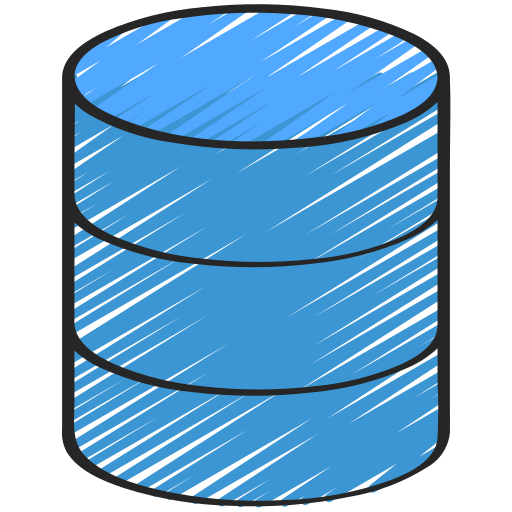

<p align="center">
    
</p>

# geoff add data-source

```shell
geoff add data-source [OPTIONS] NAME
```

Adds a new folder in data_sources folder called `NAME` which contains a metadata markdown document to populate. The metadata file captures some details about the data source and any key people that were involved in the collection or authorisation to access the data.

There are three different metadata templates that are created depending on whether the data source is a 

 database source  
  
 extract source  
  
 
web download source

## Arguments

`name`
The name of the project. This can be a project name or a path with the final directory in the path being the project name.

Project name

```shell
foo@bar:~$ geoff create test_project
```

Project with path

```shell

foo@bar:~$ geoff create path/to/test_project
```


If a path is supplied and the parents of the project name don't exist, the parents either need to be created manually or `--parents` needs to be supplied.

## Options

`--parents` \ `--no-parents`

Default: `--no-parents`

Whether to create the parents of the supplied path or not.

`--help`
Shows help message and exits

## Examples

Create a project

```shell
foo@bar:~$ geoff create test_project
🚀 test_project created!

test_project
├── 🖿 data_sources
├── 🖿 explorations
├── 🖿 models
├── 🖿 products
├── 🗋 README.md
└── 🗋 project_scoping.md
```

Create a project and parents of specified path

```shell
foo@bar:~$ geoff create --parents path/to/test_project
🚀 test_project created!

test_project
├── 🖿 data_sources
├── 🖿 explorations
├── 🖿 models
├── 🖿 products
├── 🗋 README.md
└── 🗋 project_scoping.md
```
